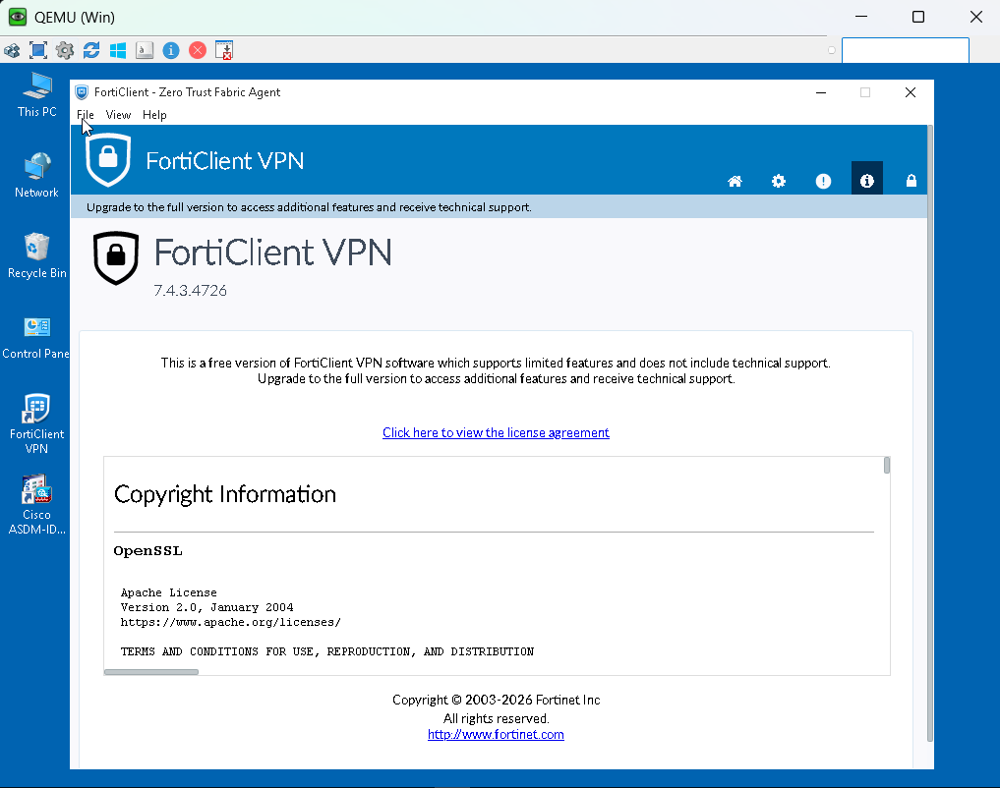

# fortigate-ssl-vpn-segmentation-lab

# FortiGate SSL VPN & Network Segmentation Lab

A hands-on lab built in EVE-NG: a Fortinet FortiGate perimeter firewall protecting two internal services (WordPress and SSH), with both clientless (Web Mode) and client-based (Tunnel Mode) SSL VPN configured for remote access — including a real, fully-diagnosed FortiClient/FortiOS version-compatibility bug.


---

## Table of Contents

- [Overview](#overview)
- [Topology](#topology)
- [Addressing Plan](#addressing-plan)
- [Build Steps](#build-steps)
  - [1. FortiGate Base Configuration](#1-fortigate-base-configuration)
  - [2. Internal Services](#2-internal-services)
  - [3. SSL VPN Configuration](#3-ssl-vpn-configuration)
- [Testing & Results](#testing--results)
- [Troubleshooting Log](#troubleshooting-log)
- [Root Cause: FortiClient / FortiOS Version Mismatch](#root-cause-forticlient--fortios-version-mismatch)
- [Lessons Learned](#lessons-learned)
- [Next Steps](#next-steps)

---

## Overview

**Goal:** stand up a small internal network behind a FortiGate, deploy two real services on it, and prove remote access works through SSL VPN in both available modes.

| | |
|---|---|
| **Lab environment** | EVE-NG |
| **Firewall** | Fortinet FortiGate-VM64-KVM, FortiOS 6.4.4 (build 1803, GA) |
| **VPN client** | FortiClient VPN 7.4.3.4726 |
| **Internal services** | WordPress (Apache/MySQL/PHP on Ubuntu Server) · SSH (Kali Linux) |
| **VPN modes tested** | Web Mode (clientless) ✅ &nbsp;·&nbsp; Tunnel Mode (FortiClient) ⚠️ root cause identified, fix not yet applied |

---

## Topology


- **Inside (port3, `192.168.1.0/24`):** Switch4 connects Kali-Linux (SSH server), a WordPress server.
- **FortiGate:** port3 = inside/LAN, port2 = outside/WAN (DHCP client).
- **Outside (port2 side):** Switch5 connects a Kali-Outside box, a Windows 10 client (the SSL VPN remote user), and a `Net` cloud node providing real internet access.

---

## Addressing Plan

| Device | Interface | IP Address | Notes |
|---|---|---|---|
| FortiGate | port3 (inside) | `192.168.1.1/24` | DHCP scope `192.168.1.20–192.168.1.30` |
| FortiGate | port2 (outside) | DHCP client | Received `192.168.40.23` |
| Kali-Linux (SSH server) | eth0 | `192.168.1.3/24` | Internal SSH target |
| WordPress | eth0 | `192.168.1.4/24` | Internal web target |
| Windows 10 (remote client) | eth0 | DHCP client | SSL VPN client endpoint |

---

## Build Steps

### 1. FortiGate Base Configuration

**Interfaces** — port3 set as a static inside interface with DHCP server enabled for unmanaged hosts; port2 set as a DHCP client on the outside.


**Outbound internet policy** — inside hosts need a NAT-enabled policy (port3 → port2) to reach the internet at all. This was required before WordPress could even download its installer.


### 2. Internal Services

**WordPress** (Ubuntu Server, LAMP stack)
- `apache2`, `mysql-server`, required PHP modules
- Dedicated MySQL database + user for WordPress
- WordPress extracted to `/var/www/html`, `wp-config.php` pointed at the new DB

Two real bugs were hit and resolved here — see the [Troubleshooting Log](#troubleshooting-log).


**SSH** (Kali Linux)
- Enabled and started `ssh` service
- Confirmed listening on port 22
- Set known credentials for testing


### 3. SSL VPN Configuration

**SSL-VPN Settings** — listening on port2, TCP 443, tunnel-mode IP pool defined for FortiClient users.


**User, group, and portal mapping** — local user `remoteuser` in a `SSLVPN-Users` group, mapped (along with the mandatory "All Other Users/Groups" catch-all) to the `full-access` portal.


**Web Mode bookmarks** — two predefined bookmarks on the portal for one-click clientless access:

| Bookmark | Type | Target |
|---|---|---|
| `WordPress-Site` | HTTP/HTTPS | `http://192.168.1.4` |
| `Kali-SSH` | SSH | `192.168.1.3:22` |


**Access control policy** — scopes what the VPN tunnel can actually reach, independent of the portal name:

```text
Name:                SSLVPN-to-Inside
Incoming Interface:  ssl.root
Outgoing Interface:  port3
Source:              SSLVPN-Users (group)
Destination:         192.168.1.0/24 (or scoped to .3 / .4 specifically)
Action:              ACCEPT
NAT:                 disabled
```


---

## Testing & Results

### Web Mode (clientless) — ✅ PASS

From the Windows client, `https://192.168.40.23/remote/login` reached FortiGate's portal with no client software installed.


After authenticating, both bookmarks worked:

- **WordPress-Site** → loaded the internal site through FortiGate's browser-based proxy. **PASS.**
- **Kali-SSH** → opened an in-browser SSH session to Kali-Linux. **PASS.**


### Tunnel Mode (FortiClient) — ⚠️ FAIL (root cause identified)

FortiClient 7.4.3.4726 was installed on the Windows client and pointed at `192.168.40.23:443` with the same credentials. Every connection attempt failed:

```
Unable to establish the VPN connection. The VPN server may be unreachable. (-5010)
```


See [Root Cause](#root-cause-forticlient--fortios-version-mismatch) below for the full diagnosis.

---

## Troubleshooting Log

<details>
<summary><strong>IPsec static route omission (related exercise, included for methodology)</strong></summary>

**Symptom:** In an earlier related two-site IPsec lab, one VLAN's traffic intermittently failed despite both Phase 1 and Phase 2 reporting healthy.

**Diagnosis:** Manually-added static routes pointing the remote subnets out the *physical* WAN interface — instead of the IPsec tunnel interface — were found on both firewalls, left over from earlier in the build.

**Fix:** Removed the conflicting routes, leaving only the wizard-created routes pointing out the tunnel interface. Traffic immediately started flowing correctly through the tunnel.

</details>

<details>
<summary><strong>WordPress: HTTP 500 — PHP parse error</strong></summary>

**Symptom:** WordPress returned a 500 error immediately after install.

**Diagnosis:** `/var/log/apache2/error.log` showed:
```
PHP Parse error: syntax error, unexpected '?', expecting variable (T_VARIABLE)
in /var/www/html/wp-includes/compat-utf8.php on line 47
```
The downloaded "latest" WordPress release used PHP syntax unsupported by the VM's older PHP version.

**Fix:** Installed an older, version-compatible WordPress release instead.

</details>

<details>
<summary><strong>WordPress: "Error establishing a database connection"</strong></summary>

**Symptom:** Database connection error after the PHP issue was resolved.

**Diagnosis:** Testing credentials directly against MySQL returned:
```
ERROR 1044 (42000): Access denied for user 'wpuser'@'localhost' to database 'wordpress'
```
Error **1044** (no privilege on that database), not 1045 (bad password) — the user account was authenticating fine but the `GRANT` hadn't taken effect.

**Fix:**
```sql
GRANT ALL PRIVILEGES ON wordpress.* TO 'wpuser'@'localhost';
FLUSH PRIVILEGES;
```

</details>

<details>
<summary><strong>FortiClient Tunnel Mode: error -5010</strong></summary>

See the full writeup below in [Root Cause](#root-cause-forticlient--fortios-version-mismatch).

</details>

---

## Root Cause: FortiClient / FortiOS Version Mismatch

Web Mode worked flawlessly over `192.168.40.23:443`. Tunnel Mode failed every time on the exact same IP and port — ruling out a network, firewall-policy, or credentials problem, since those would have broken Web Mode too.

A live debug on the FortiGate during a connection attempt told the real story:

```bash
diagnose debug application sslvpn -1
diagnose debug enable
```

```text
SSL state:SSLv3/TLS read finished (...)
SSL state:SSL negotiation finished successfully (...)
SSL established: TLSv1.2 ECDHE-RSA-AES256-GCM-SHA384
sslvpn_read_request_common,655, ret=-1 error=-1, sconn=...
Destroy sconn ..., connSize=0. (root)
```


The TLS handshake completes successfully **every single time**. Immediately after, FortiGate fails to read the post-handshake application-layer request from the client, and tears the connection down. That pattern — clean handshake, then an immediate failure in the protocol layer specific to SSL VPN tunnel negotiation — points to a **client/server protocol mismatch**, not a connectivity, certificate, or auth issue.

Confirming both component versions:

| Component | Version | Released |
|---|---|---|
| FortiGate (FortiOS) | `6.4.4`, build 1803 (GA) | 2020 |
| FortiClient VPN | `7.4.3.4726` | 2025/2026 |




**Root cause:** a four-major-version gap between FortiClient and FortiOS. FortiClient's SSL VPN tunnel-mode protocol has changed enough across that span that a current client doesn't speak the same post-handshake protocol this older FortiOS build expects. Web Mode is unaffected because it doesn't depend on that protocol layer.

**Remediation identified, not yet applied:**
- **Option A:** obtain a FortiClient build from the 6.4.x era via Fortinet's official support/firmware portal, matched to this FortiOS version. *(Avoid third-party "old version" mirror sites for this — several are reported as malware-laden; Fortinet's own support portal is the only safe source for back-versioned installers.)*
- **Option B:** upgrade this FortiGate's firmware sequentially (6.4 → 7.0 → 7.2) to support current FortiClient releases.

---

## Lessons Learned

- **A generic client-side error is a starting point, not an answer.** FortiClient's `-5010 "server may be unreachable"` looked like a network problem; the real cause was three layers deeper, in a version-specific protocol mismatch. Live server-side debugging (`diagnose debug application sslvpn`) was the only way to see that clearly.
- **Compare what works against what doesn't.** Web Mode succeeding on the identical IP/port was the single most useful clue — it eliminated an entire category of possible causes (network, cert, NAT, basic auth) before any debug command was even run.
- **MySQL error codes matter.** `1044` vs `1045` is the difference between a privilege problem and a password problem — worth knowing before reaching for `mysql_secure_installation` again.
- **"Latest" isn't always compatible.** Pulling the newest release of any software against an older underlying stack (PHP, in this case) is a common, avoidable source of otherwise-confusing failures.
- **Routing and tunnel interfaces are independent of tunnel health.** A healthy IKE/IPsec SA doesn't guarantee traffic is actually being routed into the tunnel — that's a separate, static-route-dependent decision the firewall makes per-packet.


---

*Built in EVE-NG as a self-directed lab exercise. Screenshots in `/images`.*
